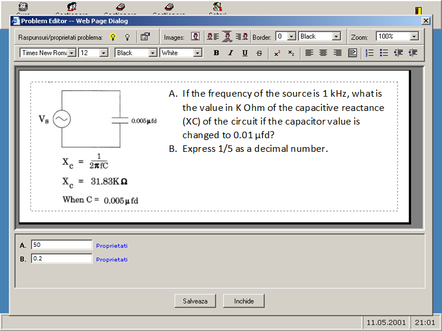

PowerTests.NET
==============

Last update: 2003

Web Application for implementing online testing / assessment in schools and universities.

PowerTest .NET is a web based multi-user educational software specially designed for usage in schools and universities as an assessment tool or for web based learning. Due to implemented features, the system can be used as a replacement for traditional assessment methods or as a complementary tool. Available in Romanian and English.

App Website
-----------

[http://www.powertests.net](http://www.powertests.net)

Screencasts
-----------

- For a better understanding of PowerTest.NET capabilities we highly recommend to check first these [screencasts](docs/screencasts/).

Features
--------

- Designed for educational environments only (not for companies - like other products);
- Tests with unlimited number of items selected explicit or random based on special filtering criteria;
- Tests must be solved in a given amount of time;
- Test items can contain formatted text and graphics;
- Test items can have up to 26 answers defined. Each answer can be selected from 4 different types: simple selection (radio buttons), multiple selection (checkbox-es), multiple multi selection (combobox-es) and input yourself (textbox-es);
- Intuitive GUI to allow students to focus on tests and not to user interface;
- Great accessibility: the application can be accessed from any point on the internet;
- Student results are saved inside the system for future analyses and comprehensive reports;
- Designed using the last standards about educational software;
- State of the art security for user data;
- Minimal system requirements (just a web browser).

Roles
-----

- Administrator
    - Manages system configuration
    - Creates and manages professor accounts
- Professor
    - Creates and manages classes 
    - Set rules / approves student enrolment to classes
    - Creates tests and questionnaires
    - See reports of students’ activity and results
- Student
    - Enroll to classes
    - Takes tests and assessments
    - View self-results

Technology
----------

- Front-end: pure DHTML (DOM + CSS + Scripting) for IE5.5 with VBScript as scripting language
- Back-end: Classic ASP pages with VBScript as scripting language
- Database: Microsoft .MDB

Notes
-----

- The powerful problem editor used by PowerTests.NET is also available as a separate project named [Web Word Editor](https://github.com/mveteanu/WebWordEditor)

